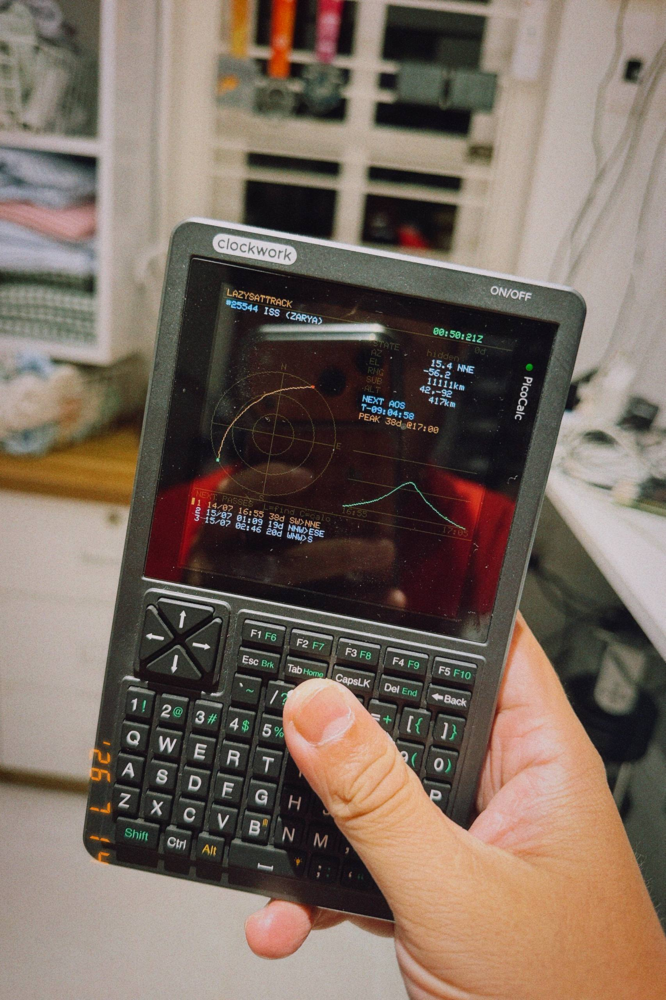

# LazySatTrack for Picoware

-lightgrey)

Offline SGP4 satellite pass tracker, ported to the **Picoware** MicroPython app
framework (start/run/stop + Draw/Input/Vector). Near-Earth (LEO) only.

  

Tracking the ISS on a ClockworkPi PicoCalc: sky plot, live telemetry, the
selected pass's peak (`PEAK 38d @17:00`), an elevation-vs-time chart, and the
upcoming pass list.

## Install
`sgp4lite` is embedded inside `LazySatTrack.py`, so it is a single-file app —
copy just these two onto your SD card (same place as FlipSocial.py etc.):

    /sd/picoware/apps/LazySatTrack.py   <- the app (case-sensitive)
    /sd/tles.txt                        <- your orbital elements (3-line TLE sets)
    /sd/station.txt                     <- optional: your ground-station location

Then on the device open **Library -> Applications -> LazySatTrack**. External
apps are listed under `Applications`; there is no top-level `LazySatTrack` entry
in the Library menu.

Use the source `.py` — it runs directly and avoids version issues. A precompiled
`.mpy` is provided at `build/LazySatTrack.mpy`, but it only loads if it matches
your firmware's exact MicroPython/mpy version; a mismatch shows
`Could not load application "LazySatTrack"`. If it doesn't load, recompile it
yourself with the `mpy-cross` that matches your Picoware build (`mpy-cross
LazySatTrack.py -o build/LazySatTrack.mpy`) and delete any stale `.mpy` from the card first.

`tles.txt` here is a 2021-epoch sample so you can try it immediately; replace with
fresh elements from CelesTrak for real predictions (the app flags TLE age in red
once >14 days old).

## Controls
    UP / DOWN     select pass (updates the sky plot)
    LEFT / RIGHT  previous / next satellite
    L             find / search picker
    C             recompute passes
    BACK / ESC    exit (or leave the picker)

Picker: type digits to filter by NORAD id, letters by name; UP/DOWN move;
ENTER tracks; BACKSPACE edits; BACK/ESC cancels.

## Notes / caveats
- **Ground station**: put a `/sd/station.txt` on the card to set your location without
  recompiling (copy `station.sample.txt` to `/sd/station.txt` and edit). Format is `KEY value` lines
  (`LAT`/`LON`/`ALT`/`TZ`) or one positional line `lat lon alt tz`; decimal degrees,
  latitude N +/S -, longitude E +/W -, ALT in km, TZ in hours from UTC. Missing keys
  and a missing file fall back to the built-in defaults (Hanoi) baked into LazySatTrack.py.
- **Time**: uses the RP2350 RTC via `machine.RTC()`. If Picoware hasn't set the clock
  (e.g. no NTP sync), it falls back to 2021-05-03 so the sample TLEs still give sane
  passes. For live use, sync time (NTP) first, then load fresh TLEs.
- **Colors** are built with `draw.color332(draw.color565(...))` for the PicoCalc 8-bit
  palette. If they look off on your board, that conversion is the one line to adjust.
- **Scope**: near-Earth SGP4 only (period < ~225 min). Deep-space (GPS/GEO/Molniya)
  is not modelled. Validated numbers: ISS alt 418 km, |v| 7.66 km/s, period 92.95 min.
- **WiFi TLE fetch** isn't wired in this port (offline). It can be added later using
  Picoware's `HTTP` class + `view_manager.get_wifi()`.

## What was tested
The orbital math (`sgp4lite.py`) is validated to reference numbers, and the whole
app (state machine, filter/picker, pass finding = 3 Hanoi passes, draw-call sequence)
was run headless against stubs. The Picoware-specific rendering (exact fonts/colors on
real RGB332 hardware) can only be confirmed on the device.
